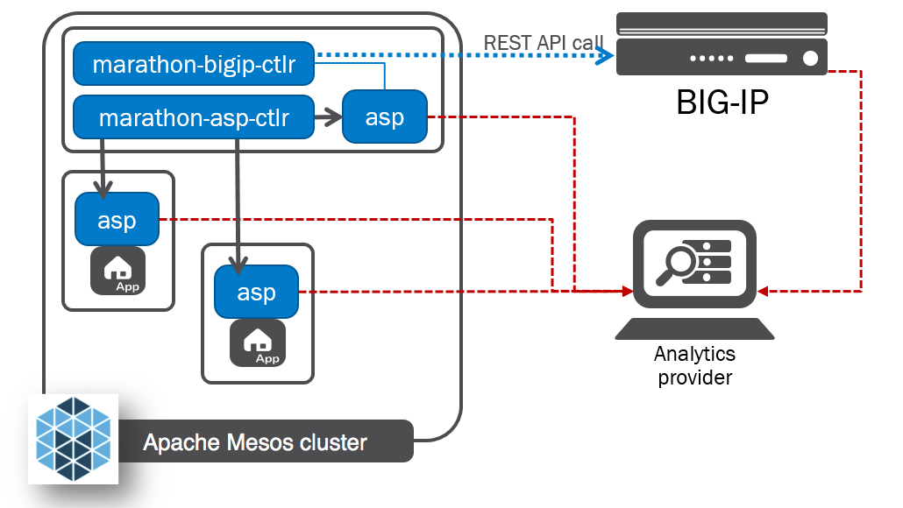

F5 ASP and F5 Marathon ASP Controller
=====================================

Overview
--------

The F5 Application Service Proxy provides load balancing and telemetry for containerized applications, serving East-West traffic. The F5 Marathon ASP Controller deploys ASP instances ‘on-demand’ for Marathon Applications.

The F5 Application Service Proxy (ASP) provides container-to-container load balancing, traffic visibility, and inline programmability for applications. Its light form factor allows for rapid deployment in datacenters and across cloud services. The ASP integrates with container environment management and orchestration systems and enables application delivery service automation.

its documentation is available here: `F5 Application Services Proxy <http://clouddocs.f5.com/products/asp/v1.0/index.html>`_

The F5 Marathon ASP Controller – called **marathon-asp-ctlr** – deploys the F5 Application Service Proxy. Like the F5 Marathon BIG-IP Controller, the F5 Marathon ASP Controller watches the Marathon API for Apps defined with a specific set of labels. When it finds an Application configured with the **asp: enable** label, it launches an instance of the F5 Application Service Proxy to front the App and creates a virtual server on the F5 Application Service Proxy instance. The F5 Marathon ASP Controller maintains an address in the F5 Application Service Proxy pool configuration for each of an Application’s tasks.

The F5 Marathon ASP Controller App definition contains a set of default Marathon ASP configuration labels. These configurations – set in the “env” (or, “Environment”, in the Web UI) section of the marathon-asp-ctlr App definition – apply to each ASP instance the marathon-asp-ctlr launches. The F5 Marathon ASP Controller also has a set of “override” labels. When you add these labels to the definition for an Application you want the ASP to proxy, they take precedence over the default marathon-asp-ctlr settings.

By default, the marathon-asp-ctlr starts one (1) F5 Application Service Proxy instance per application. You can override this setting using the ASP_COUNT_PER_APP F5 application label.

The F5 Application Service Proxy collects traffic statistics for the Applications it load balances; these stats are either logged locally or sent to an external analytics application. You can set the location and type of the analytics application using the ASP_DEFAULT_STATS_URL label.

Apache Mesos DNS and ASP Discovery
----------------------------------

Each F5 Application Service Proxy instance is discoverable via an Apache Mesos DNS SRV query, which returns its IP address, port, and protocol. By convention, the DNS name of an F5 Application Service Proxy instance for an Application is “<ASP_ENABLE_LABLE>-<application name>.<domain name>”.

For example:

::

	ASP_ENABLE_LABEL: ASP +
	Application name: “app1” +
	Domain name: “marathon.mesos” =

	ASP DNS name: “ASP-app1.marathon.mesos”

