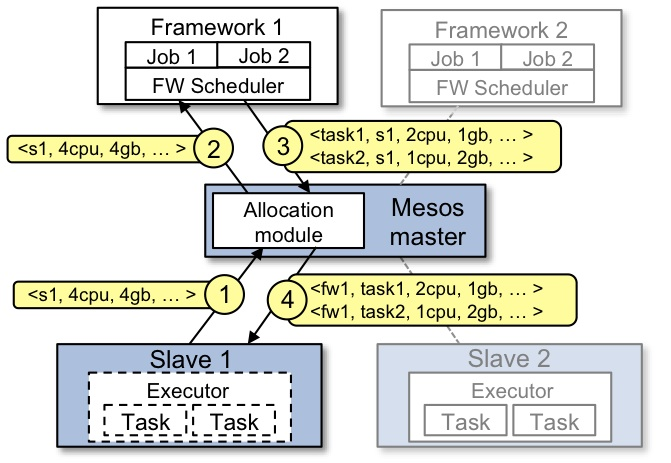

Intro to Mesos / Marathon
===========================================

Before working on the installation itself, you need to understand the different components involved in this setup: 

* Master / Agent functions
* The different components involved in the Master / Agent architecture
* How High availability is achieved
* Marathon overview

Mesos Architecture
------------------

This is an extract from `Mesos Architecture <http://mesos.apache.org/documentation/latest/architecture/>`_

Some of the involved components: 

* Master: aggregates resource offers from all agent nodes and provides them to registered frameworks.

* Agent: runs a discrete Mesos task on behalf of a framework. It is an agent instance registered with the Mesos master. The synonym of agent node is worker or slave node. You can have private or public agent nodes. Agent daemon can run on the same component than the master daemon. This is useful when you need a small environment for testing

* Framework: "Applications" running on Mesos. It is composed of a scheduler, which registers with the master to receive resource offers, and one or more executors, which launches tasks on slaves. Examples of Mesos frameworks include Marathon, Chronos and Hadoop

* Offer: a list of a agent's available CPU and memory resources. All agents send offers to the master, and the master provides offers to registered frameworks

* Executors: launched on agent nodes to run tasks for a service.

* Task: a unit of work that is scheduled by a framework, and is executed on an agent node. A task can be anything from a bash command or script, to an SQL query, to a Hadoop job, a docker image

* Apache ZooKeeper: software that is used to coordinate the master nodes and achieve High availability

* Service discovery: When your app is up and running, you need a way to send traffic to it, from other applications on the same cluster, and from external clients.

Example of resource offer
-------------------------

This is an extract from Apache Mesos website `Mesos Architecture <http://mesos.apache.org/documentation/latest/architecture/>`_

Let’s walk through the events in the figure.

1. Agent 1 reports to the master that it has 4 CPUs and 4 GB of memory free. The master then invokes the allocation policy module, which tells it that framework 1 should be offered all available resources.
2. The master sends a resource offer describing what is available on agent 1 to framework 1.
3. The framework’s scheduler replies to the master with information about two tasks to run on the agent, using <2 CPUs, 1 GB RAM> for the first task, and <1 CPUs, 2 GB RAM> for the second task.
4. Finally, the master sends the tasks to the agent, which allocates appropriate resources to the framework’s executor, which in turn launches the two tasks (depicted with dotted-line borders in the figure). Because 1 CPU and 1 GB of RAM are still unallocated, the allocation module may now offer them to framework 2.

In addition, this resource offer process repeats when tasks finish and new resources become free.

Service Discovery
-----------------

One way to enable service discovery is to leverage Mesos DNS. Mesos DNS provides service discovery through domain name system (DNS).

Mesos-DNS periodically queries the Mesos master(s), retrieves the state of all running tasks from all running frameworks, and generates DNS records for these tasks (A and SRV records). As tasks start, finish, fail, or restart on the Mesos cluster, Mesos-DNS updates the DNS records to reflect the latest state.

Running tasks can be discovered by looking up A and, optionally, SRV records within the Mesos domain.

* An A record associates a hostname to an IP address

* An SRV record associates a service name to a hostname and an IP port

High Availability
-----------------

Marathon supports high availability be leveraging Zookeeper. High availability allows applications to keep running if an instance becomes unavailable. This is accomplished by running several Marathon instances that point to the same ZooKeeper quorum. ZooKeeper is used to perform leader election in the event that the currently leading Marathon instance fails.

If you want to learn more about Zookeeper, refer to their website `Zookeeper <http://zookeeper.apache.org/>`_

With Zookeeper, it is recommended to have an odd number of servers. 

Marathon 
--------

Marathon is a production-proven Apache Mesos framework for container orchestration. the github project can be found here: `Github Marathon <https://github.com/mesosphere/marathon>`_ , documentation is `here <http://mesosphere.github.io/marathon/>`_

Marathon is a framework for Mesos that is designed to launch long-running applications, and, in Mesosphere, serves as a replacement for a traditional *init* system. It has many features that simplify running applications in a clustered environment, such as high-availability, application health checks, ... It adds its scaling and self-healing capabilities to the Mesosphere feature set.

Marathon can be used to start other Mesos frameworks, and it can also launch any process that can be started in the regular shell. As it is designed for long-running applications, it will ensure that applications it has launched will continue running, even if the slave node(s) they are running on fails.

Main features

1. High Availability. Marathon runs as an active/passive cluster with leader election for 100% uptime.
2. Multiple container runtimes. Marathon has first-class support for both Mesos containers (using cgroups) and Docker.
3. Stateful apps. Marathon can bind persistent storage volumes to your application. You can run databases like MySQL and Postgres, and have storage accounted for by Mesos.
4. UI.
5. Constraints. e.g. Only one instance of an application per rack, node, etc.
6. Service Discovery & Load Balancing. Several methods available.
7. Health Checks. Evaluate your application's health using HTTP or TCP checks.
8. Event Subscription. Supply an HTTP endpoint to receive notifications - for example to integrate with an external load balancer.
9. Metrics. Query them at /metrics in JSON format or push them to systems like graphite, statsd and Datadog.
10. Complete REST API for easy integration and scriptability.

