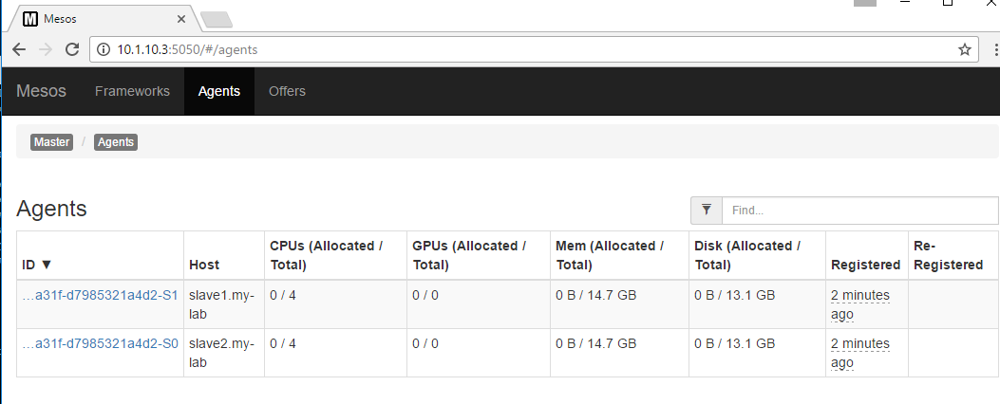

Start your services
===================

We need to make sure that zookeeper and mesos-master don't run on those agents. Do this on **all agents**: 

::

	sudo  systemctl stop zookeeper
	printf manual | sudo tee /etc/init/zookeeper.override

	sudo systemctl stop mesos-master
	printf manual | sudo tee /etc/init/mesos.master.override

We enable/start the agent process called mesos-slave

::
	
	sudo systemctl enable mesos-slave
	sudo systemctl start mesos-slave

Check on one of your master with mesos interface (port 5050) if your agents registered successfully. You should see both slave1 and slave2 in the agent page

