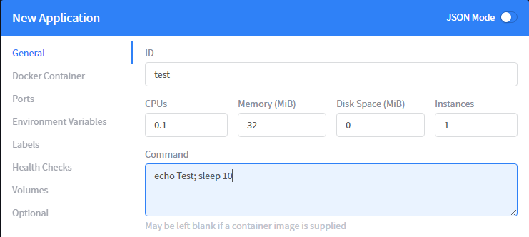
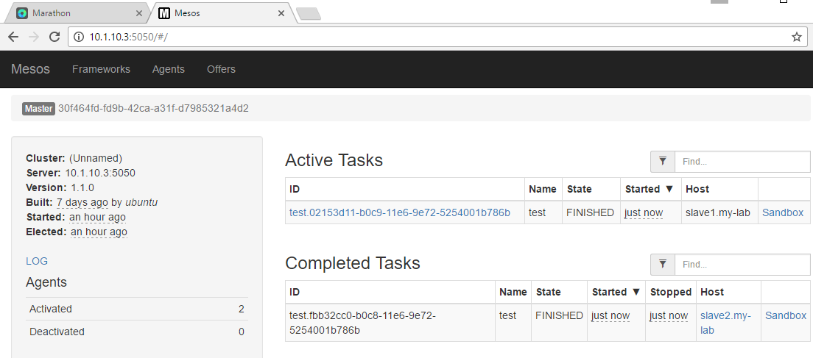
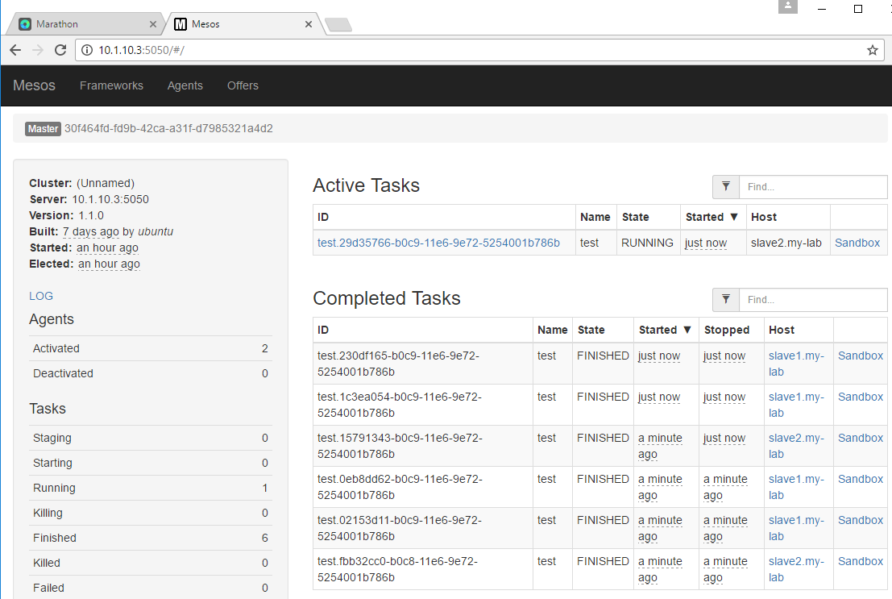
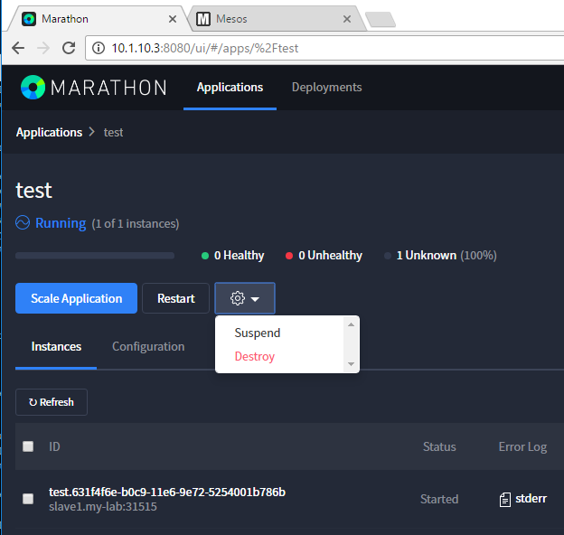
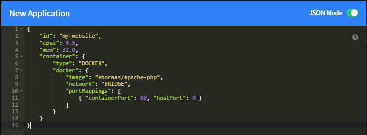
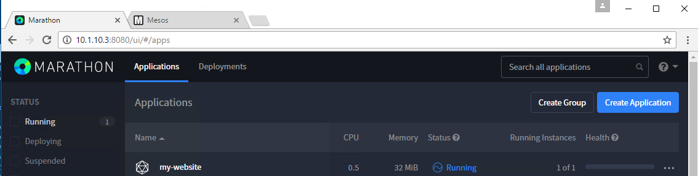
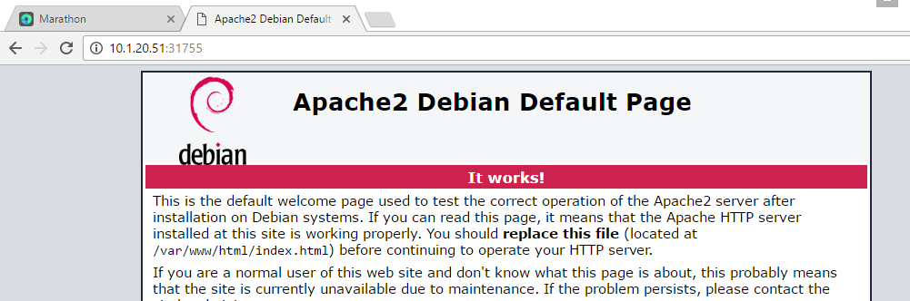

Test your setup
===============

Launch a command
----------------

Connect to Marathon through one of the master (:8080) and launch an application

1.  Click on *create application*
   

2.  ID: Test
  CPU: 0.1
  Memory : 32M
  Command: echo Test; sleep 10
3.  Click on *Create Application*
    

Once it runs, if you connect to the mesos framework, you should see more and more completed tasks. Name of the task should be "Test" (our ID). 

If you let it run for a while, you'll see more and more "Completed Tasks". You can see that the Host being selected to run those tasks is not always the same.

Go Back to Marathon, click on our application *test* and click on the setting button and select *destroy* to remove it. 

Launch a container
------------------

To test our containers from marathon, click on create an application, switch to JSON mode and use the following to start an apache in a container 

::

  this may takes some time since we will have to retrieve the image first

.. code-block:: none

  {
    "id": "my-website",
    "cpus": 0.5,
    "mem": 32.0,
    "container": {
        "type": "DOCKER", 
        "docker": {
            "image": "eboraas/apache-php",
            "network": "BRIDGE",
            "portMappings": [
                { "containerPort": 80, "hostPort": 0 }
            ]
        }
    }
  }

It may take some time to switch from "Deploying" to "Running". Once it's in a "Running" state, check the port used by the container and try to access it (slave IP:port)

Click on your application and here you'll see the port associated to your instance (here it is 31755) and on which host it run (here slave1 - 10.1.20.51)

  .. image:: ../images/setup-slave-test-create-container-check-port.png
    :align: center

Use your browser to connect to the application: 

