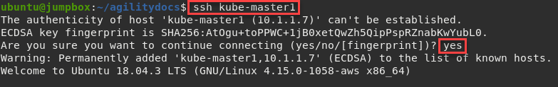

Appendix 8: Replace Flannel w/ Calico
=====================================

This appendix will walk through the steps to replace Flannel with Calico.

Expected time to complete: **15 minutes**

Via RDP connect to the UDF lab "jumpbox" host.

.. note:: Username and password are: **ubuntu/ubuntu**

On the jumphost open a terminal and start an SSH session with kube-master1.

.. image:: images/start-term.png

.. code-block:: bash

   # If directed to, accept the authenticity of the host by typing "yes" and hitting Enter to continue.

   ssh kube-master1

Remove Flannel
--------------

#. Show running Flannel pods

   .. code-block:: bash

      kubectl get pods -n kube-system

   .. image:: images/getpods.png

#. Remove Flannel

   .. code-block:: bash

      kubectl delete -f https://raw.githubusercontent.com/coreos/flannel/master/Documentation/kube-flannel.yml

#. Validate Flannel pods are removed. (Run previous kubectl command)

   .. code-block:: bash

      kubectl get pods -n kube-system

   .. image:: images/noflannelpods.png

   .. note:: Run this command several times until you no longer see the
      "kube-flannel" pods.

#. Cleanup CIS deployment file.

   .. note:: This step can be skipped but several errors will appear in the
      CIS pod log.

   .. code-block:: bash

      vim ~/agilitydocs/docs/class1/kubernetes/cluster-deployment.yaml

   Remove "--flannel-name=k8s-tunnel" from the bottom of the file. Be sure to
   remove the "," on the line above the removed the line. After editing the
   file should look like the following:

   .. image:: images/newclusterdeployment.png

Install Calico
--------------

#. Change local directory to the lab calico dir.

   .. code-block:: bash

      cd ~/agilitydocs/docs/class1/kubernetes/calico

#. Download calico manifest

   .. code-block:: bash

      curl https://docs.projectcalico.org/manifests/calico.yaml -O

#. Modify the manifest with proper POD CIDR

   .. important:: This lab was built with Flannel and the default POD CIDR
      of 10.244.0.0/16. The calico.yaml manifest uses 192.168.0.0/16 so has
      to be adjusted.

   .. code-block:: bash

      vim calico.yaml

   .. note:: If unfamiliar with VI the instructor will walk you through the
      commands.

   Find the "CALICO__IPV4POOL_CIDR variable and uncomment the two lines as
   shown below. Replacing "192.168.0.0/16" with "10.244.0.0/16"

   .. image:: images/updatecidr.png

#. Start Calico on the cluster

   .. code-block:: bash

      kubectl apply -f calico.yaml

#. Validate Calico pods are installed and running

   .. code-block:: bash

      kubectl get pods -n kube-system

   .. image:: images/calicopods.png

Install calicoctl
-----------------

#. Retrieve the calicoctl binary

   .. code-block:: bash

      curl -O -L https://github.com/projectcalico/calicoctl/releases/download/v3.15.1/calicoctl

      chmod +x calicoctl

      sudo mv calicoctl /usr/local/bin

#. Copy the the calicoctl.cfg file to /etc/calico/

   .. literalinclude:: ../../class1/kubernetes/calico/calicoctl.cfg
      :language: yaml
      :linenos:
      :emphasize-lines: 6

   .. code-block:: bash

      sudo mkdir /etc/calico

      sudo cp calicoctl.cfg /etc/calico/

#. Verify calicoctl is properly set up

   .. code-block:: bash

      calicoctl get nodes

   .. image:: images/caligetnodes.png

#. Set up the Calico BGP config

   .. literalinclude:: ../../class1/kubernetes/calico/caliconf.yaml
      :language: yaml
      :linenos:
      :emphasize-lines: 8

   .. code-block:: bash

      calicoctl create -f caliconf.yaml

#. Set up the BIG-IP BGP peer

   .. literalinclude:: ../../class1/kubernetes/calico/calipeer.yaml
      :language: yaml
      :linenos:
      :emphasize-lines: 6,7

   .. code-block:: bash

      calicoctl create -f calipeer.yaml

#. Verify setup

   .. code-block:: bash

      calicoctl get bgpPeer

#. Change dir back to working lab directory

   .. note:: The necessary kubernetes lab files can be found in this directory.

   .. code-block:: bash

      cd ..

      # or

      cd ~/agilitydocs/docs/class1/kubernetes/

Confgure BIG-IP for Calico
--------------------------

Open firefox and connect to bigip1 management console. For your convenience
there's a shortcut on the firefox toolbar.

.. note:: Username and password are: **admin/admin**

#. Enable BGP on route domain 0

   a. Connect to the BIG-IP GUI and go to
      :menuselection:`Network --> Route Domains`
   #. Click on "0" to open route domain 0
   #. Under Dynamic Routing Protocols, move "BGP" from Available to Enabled
   #. Click Update

   .. image:: images/enablebgp.png

#. Open a new terminal tab and SSH to BIG-IP

   .. code-block:: bash

      # If directed to, accept the authenticity of the host by typing "yes" and hitting Enter to continue.

      # passwd = admin

      ssh admin@10.1.1.4

#. Configure BGP

   .. code-block:: bash

      #access the IMI Shell
      imish

      #Switch to enable mode
      enable

      #Enter configuration mode
      config terminal
      #Setup route bgp with AS Number 64512
      router bgp 64512

      #Create BGP Peer group
      neighbor calico-k8s peer-group

      #assign peer group as BGP neighbors
      neighbor calico-k8s remote-as 64512

      #we need to add all the peers: the other BIG-IP, our k8s components
      neighbor 10.1.1.7 peer-group calico-k8s
      neighbor 10.1.1.8 peer-group calico-k8s
      neighbor 10.1.1.9 peer-group calico-k8s

      #on BIG-IP 1, run
      neighbor 10.1.1.24 peer-group calico-k8s

      #on BIG-IP 2, run
      neighbor  10.1.1.4 peer-group calico-k8s

      #save configuration
      write

      #exit
      end

#. Verify BGP is running

   .. code-block:: bash

      show ip bgp neighbors

#. Check BIG-IP routes

   .. code-block:: bash

      exit # Exit Zebos first

      route

   .. image:: images/routes.png
